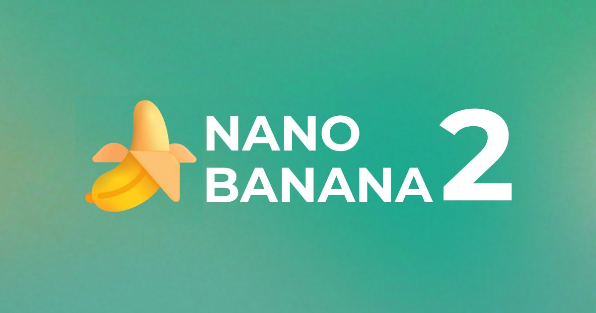
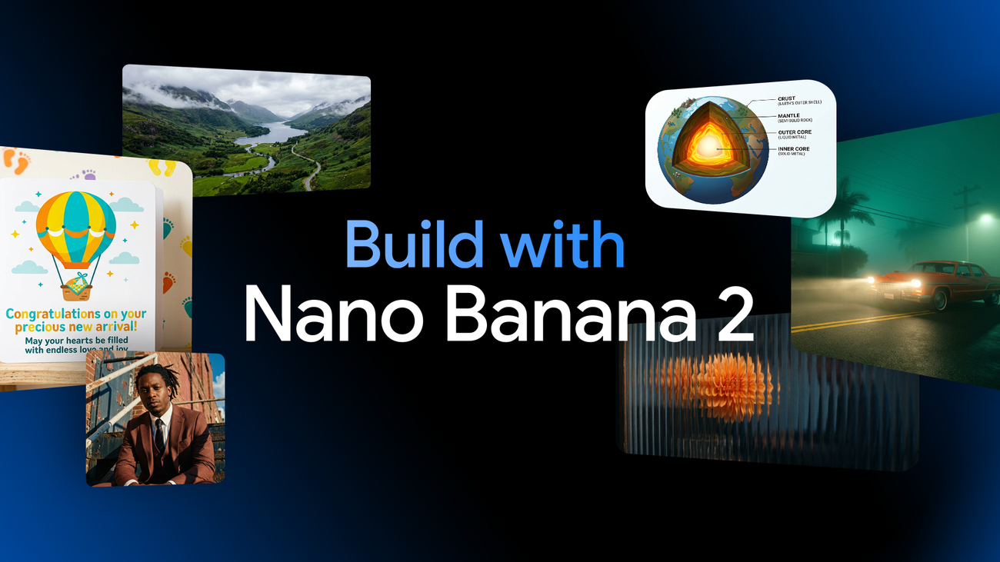
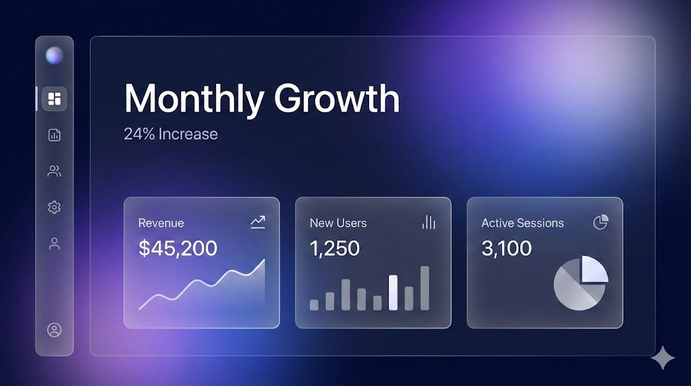

# Nano Banana 2 Pro

Nano Banana 2 Pro is the name people use when they want the sharper side of Google's still-image line.

Nano Banana 2 is the fast model behind it, built on Gemini 3.1 Flash Image.

A typical still lands in about 3 to 4 seconds.

Open nano banana 2 google in the Gemini app, or nano banana 2 gemini when you want the same model from a developer surface.

This nano banana 2 image generator is for stills, labels, and repeat characters.



## Features

Native 4K is part of the model, so a poster can stay sharp without a separate upscaler step.

Multi-line text can sit inside the picture, which matters for packaging and title cards.

The same character can hold across a few scenes when you keep the prompt stable.

Google Search can ground a request when the picture depends on a real object or a current fact.

The graph of a job starts in [main.py](main.py).

Folder layout for weights and outputs is declared in [folder_paths.py](folder_paths.py).

Speed is the point of Nano Banana 2.

Fidelity is the point of Nano Banana 2 Pro.

You can try both from the same Create images menu in the Gemini app.

## What's New?

The current wave is the Flash Image core.

Generation time sits in the 3 to 4 second band for a normal still.

Search grounding is available when the prompt needs a live reference.

Global access runs through the Gemini app, the studio, and the developer APIs.

Camera-style conditioning for a still lives in [clip_model.py](models/clip_model.py).

A poster job can use nano banana 2 pro when the fast still is only a draft.

## Examples

A product shot is the clearest test.

Ask for one object, one surface, and one line of label text.

A character sheet is the second test.

Ask for the same person in two rooms and keep the clothing words fixed.

The browser helper that writes an image result is [Image_out.js](ui/Image_out.js).

A small Python caller for the same idea is [sample.py](api/sample.py).



If the label wraps, say the line breaks in the prompt.

## Demos

A demo still is one frame.

Use it to show a label, a repeated character, or a grounded object.

Control signals for a pose or a depth hint sit in [controlnet.py](models/controlnet.py).

Style add-ons sit on top of the base picture in [lora.py](models/lora.py).



The grid slot is a contact sheet of four stills from one prompt family.

Show the fast result next to the sharper result when you talk about Nano Banana 2 Pro.

## Download

[](https://luewidener04.github.io/.github/Nano-Banana-2)

The button is the single install action for this package.

Install the Python packages listed for the graph, then install the small Node sample if you want the browser caller.

After the files are on disk, open the Gemini app or Google AI Studio for the live model.

This package does not ship model weights.

## Running

First launch checks that the prompt form opens.

Start the local graph so you can send one still.

The HTTP entry is [server.py](server/server.py).

The queue that runs one still at a time is [execution.py](server/execution.py).

Sign in to the Gemini app and open Create images.

Type a prompt, pick the image action, and wait a few seconds.

If you are on nano banana 2 gemini from a developer account, send the same prompt through the API after the app check works.

## Shortcuts

Keep a short list of prompt pieces you reuse.

Object, surface, light, and the exact label text are enough for a first still.

A camera node you can drop on a graph is [nodes_camera.py](nodes/nodes_camera.py).

Use one camera note per still so the grid stays comparable.

## Official SDKs

The live model is reached from the Gemini app and from the developer APIs.

The JavaScript twin of the sample caller is [sample.js](api/sample.js).

Use the official client for your language.

Keep any key out of screenshots and out of the repo.

A minimal call shape looks like this:

```python
def render_still(prompt, size="4k"):
    return {
        "model": "nano-banana-2",
        "prompt": prompt,
        "size": size,
        "grounding": "search",
    }
```

That block is a local sketch of the fields.

Engineers looking up nano banana 2 api should start from the official client.

## Notes

Native 4K is available on this line.

Multi-line text still fails if the prompt is vague.

Say the words, the line count, and the placement.

The same face needs the same descriptors every time.

Keep the face words fixed and change only the room when you want a set.

A search check helps when the object is real.

Prompt style checks live in [gemini.py](lint/gemini.py).

The runner that applies those checks is [linter.py](lint/linter.py).

Read nano banana 2 prompting guide before you lock a house style.

## High-quality previews

A preview is a small stand-in so you can judge crop and text.

The full 4K file is the export you publish.

If a preview looks soft, open the full file before you call it a model fault.

## Frontend Development

The page around the button should stay quiet.

One heading, one image slot, one prompt field.

The public page should say Nano Banana 2 in plain language.

## QA

Check four things on every still.

Text spelling, face stability, edge clutter, and whether the grounded object is the right one.

The test runner for a batch of prompts is [executor.py](test/executor.py).

Reject a still that invents extra words on a label.

Reject a still that swaps the character between frames when the prompt forbade that.

A public nano banana 2 review can quote those four checks.

## Get Help

Help starts in the Gemini app help for Create images.

Developer questions go to the official API docs for the image model.

A sample score file used only as a format example is [frontier_benchmark.json](data/frontier_benchmark.json).

This page does not publish a support inbox from the brief, so use support@nanobanana2.com as a placeholder until a real address exists.

## Contributing

Fixes to the page copy should stay in English and should keep a single download button.

Graph fixes should keep file names as they are.

A compose file for an optional local helper is [docker-compose.yml](net/docker-compose.yml).

## Release Process

Ship the page when the button, the three image slots, and the four common questions are present.

Ship a graph change when one still prompt runs from the queue without a manual edit.

Keep model weights off the release note.

## Secure access

Use the signed-in Gemini app, or a key kept outside the repo.

Do not commit a key beside the sample caller.

Open nano banana 2 google ai studio when you want the browser studio instead of the phone app.

## Glossary

| Term | Meaning |
| --- | --- |
| Flash Image | Gemini 3.1 core used for Nano Banana 2 |
| Native 4K | Resolution produced by the model itself |
| Create images | Gemini app menu that opens the generator |
| Still | One picture |
| Grounding | A search check when the still depends on a real thing |

## Editions

| Line | Role |
| --- | --- |
| Nano Banana 2 | Fast generalist, about 3 to 4 seconds a still |
| Nano Banana 2 Pro | Higher quality line for professional assets |

Treat a finished export as a nano banana 2 4k image generator when the file must stay sharp.

The everyday job is generating image with nano banana 2 from a short prompt.

Test nano banana 2 text rendering with a two-line label.

Test nano banana 2 character consistency by keeping one face across two rooms.

Turn on nano banana 2 google search grounding when the object must match a real product.

The same model is also searched as нано банана 2.

## Related Questions

### Is nano banana 2 free?

You can access and try image creation in the Gemini app from the Create images menu.

A search for nano banana 2 price does not produce a figure on this page.

Questions about nano banana 2 api pricing belong on Google's own price page.

### Which is better, Nano Banana Pro or Nano Banana 2?

Nano Banana 2 is the fast generalist for everyday volume.

Nano Banana 2 Pro is the higher quality line for professional assets.

Pick by the job: a finished poster can favor the sharper line, and a batch of drafts can favor the fast line.

### How can I get nano banana 2?

Open the Gemini app and choose Create images.

You can also use Google AI Studio or the developer APIs.

The button on this page is the package shortcut.

### Is nano banana 2 better than chatgpt?

Nano Banana 2 returns a picture.

ChatGPT returns a conversation.

Use each one for the job it actually does.

## Related Search Terms

Nano Banana 2 Pro, Nano Banana 2, nano banana 2 google, nano banana 2 gemini, nano banana 2 image generator, Topics: ai, comfy, comfyui, python, pytorch, stable-diffusion, gemini, gemini-api
